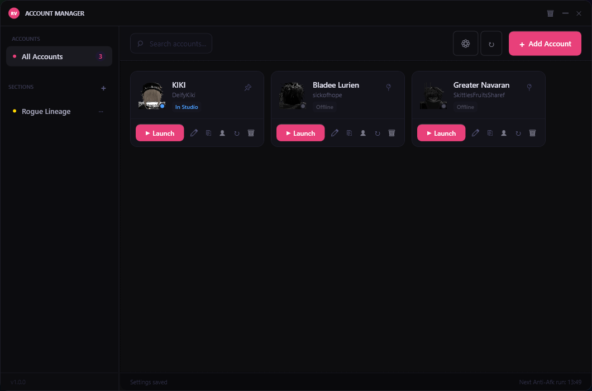
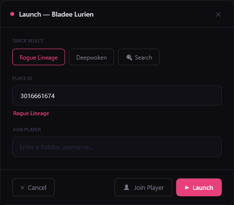
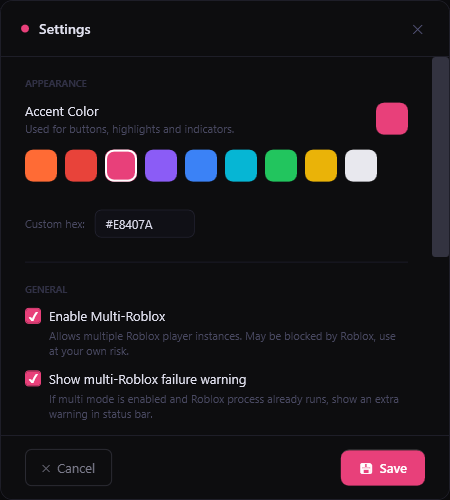
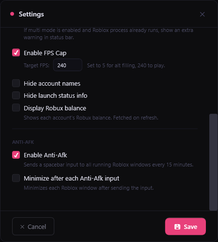

# RobloxVault

A modern, cleaner alternative to the classic Roblox Account Manager. Store, launch, and manage multiple Roblox accounts from a single interface, with a slicker UI and more settings than the original.

---

## Screenshots

| Main Window | Launch Dialog |
|:-----------:|:-------------:|
|  |  |
|  |  |

---

## Features

| Feature | Description |
|---|---|
| **Multi-account management** | Store unlimited accounts with encrypted cookies |
| **One click launch** | Launch any account into any game by Place ID |
| **Multi-launch** | Select multiple accounts and launch them all at once with a configurable delay |
| **Game search** | Search for games by name directly from the launch dialog |
| **Join player** | Join someone's server by their Roblox username if they have joins enabled |
| **Open in browser** | Open any account in browser |
| **Multi-Roblox** | Run multiple Roblox instances simultaneously |
| **FPS cap** | Set a custom FPS cap per-session |
| **Anti-AFK** | Automatically sends input to all running Roblox windows every 15 minutes |
| **Robux balance** | Optionally display each account's Robux balance |
| **Custom cards** | Add coloured label cards to any account to track whatever you want |
| **Sections** | Organise accounts into custom groups |
| **Rogue Lineage section** | Automatically created on first launch. Accounts inside get an extra edit panel to track owned artifacts, shown as coloured dots and badges on the card |
| **Server info window** | A live window showing your current server's player count, region, and age. Configurable refresh rate down to 2 seconds |
| **Import from Account Manager** | Import accounts directly from the original Roblox Account Manager, sections are created automatically from groups |
| **Discord webhook** | Send a webhook notification when an account disconnects from Roblox |
| **Accent colours** | Customise the UI colour with presets or a custom hex code |
| **Pinning** | Pin frequently used accounts to the top |

---

## Requirements

- Windows 10 or later
- [.NET 8.0 Desktop Runtime](https://dotnet.microsoft.com/en-us/download/dotnet/8.0) (x64)
- Roblox installed

---

## Installation

1. Go to the [Releases](../../releases) page
2. Download the latest `RobloxVault.zip`
3. Extract and run `RobloxVault.exe`

---

## Usage

### Adding an account
1. Click **Add Account**
2. Paste your `.ROBLOSECURITY` cookie
3. Optionally give the account a display name
4. Click **Add**, the cookie is verified and saved encrypted

### Launching an account
1. Click **▶ Launch** on any account card
2. Enter a Place ID or search for a game by name
3. Click **Launch**

### Launching multiple accounts
1. Click on any account cards to select them
2. Click **Launch (x)** in the top bar
3. Enter a Place ID or search for a game, each account will launch with the configured delay between them

### Joining a player
1. Click **▶ Launch** on the account you want to use
2. Type the target player's Roblox username in the **Join Player** field
3. Click **Join Player**

### Custom cards
1. Click **✏ Edit** on any account card
2. Click **Add Card** and give it a name and colour
3. Click the card on the account to toggle it on or off

### Server info window
1. Open **Settings** and go to the **Server** tab
2. Enable **Show Server Info Window**
3. Save, the window will open and update live as your account moves between servers
4. Adjust the refresh interval in settings, minimum is 2000ms (2 seconds)

### Importing from Roblox Account Manager
1. Open the original Roblox Account Manager folder and grab your AccountData.json
2. Download RAMDecrypt and decrypt your AccountData
3. Click the **Import** button in the top bar
4. Select your AccountData.json file, sections are created automatically from groups

[Video Tutorial](https://www.youtube.com/watch?v=YGkR_dXtCw4&feature=youtu.be)

### Rogue Lineage section
The Rogue Lineage section is created automatically when you first open the app. Accounts added to it get an extra edit panel (✏) where you can set a character note and toggle which artifacts the account owns. These show up as coloured dots and labelled badges directly on the account card.

### Anti-AFK
1. Open **Settings**
2. Enable **Anti-AFK**
3. Optionally enable **Minimize after each anti-AFK input**
4. Save, it runs in the background automatically

### Discord webhook
1. Open **Settings** and go to the **Discord** tab
2. Enable **Discord Webhook** and paste your webhook URL
3. Optionally enable **@everyone** pings or customise the message
4. Save, a notification will be sent whenever an account disconnects from Roblox

### Multi-Roblox
Enable in Settings. Works by holding the Roblox singleton mutex so multiple instances can run at once. Roblox may patch this at any time, use at your own risk.

---

## Cookie Security

Cookies are encrypted at rest using Windows DPAPI before being saved to disk, meaning they are tied to your Windows user account and cannot be decrypted on another machine. They are never logged or transmitted anywhere other than directly to Roblox's own endpoints.

---

## FAQ

Why can't I launch multiple accounts?

Multi-Roblox is disabled by default. A Roblox staff member stated that Hyperion blocks attempts to run multiple instances and that circumventing this block is considered malicious behavior. You can still enable it in Settings, but it is a use-at-your-own-risk feature and may result in consequences I cannot predict or be responsible for.

My antivirus flagged this as a virus. Is it safe?

The full source code is publicly available, feel free to read through it yourself before running anything. False positives are common with apps that interact with other processes or download files at runtime, both of which this app does for legitimate reasons.

I found a bug or something isn't working.

You can contact me on Discord: **imlowkeykiki** (ID: `1192601725748646040`). Screenshots and a clear description of what happened help a lot.

Can I get banned for using this?

There is no official statement from Roblox that using account managers is bannable, and the core features do not modify the game client in any way. That said, some games disallow alt accounts in their own rules, so check the rules of any game you play.

The app says my cookie is invalid but I copied it correctly.

Make sure you copied the full cookie value including the `_|WARNING` prefix. Some browsers truncate it when you select it, try right clicking the cookie in DevTools and copying the value directly.

The app downloaded Chromium on first launch, is that normal?

Yes. The Open in Browser feature requires a lightweight browser engine (~150MB). It only downloads once and is stored in your AppData folder.

Can I use this on multiple PCs?

The exe itself works anywhere, but your saved cookies are encrypted with Windows DPAPI and tied to your user account. They cannot be transferred to another machine, you would need to re-add your accounts. (This may change once proper Export/Import support is added.)

My accounts keep getting logged out.

Roblox invalidates cookies when you log out from the website or change your password. Re-add the account with a fresh cookie.

---

## Acknowledgements

RobloxVault was heavily inspired by [Roblox Account Manager](https://github.com/ic3w0lf22/Roblox-Account-Manager) by ic3w0lf22. A lot of the core concepts, launch methods, and approaches used in this project were referenced from it. Go check it out if you haven't.

ic3w0lf22/Roblox-Account-Manager is licensed under the GNU General Public License v3.0.

---

## License

This project is licensed under the **GNU General Public License v3.0**. See [LICENSE](LICENSE) for the full text.

> This software is not affiliated with, endorsed by, or connected to Roblox Corporation in any way.